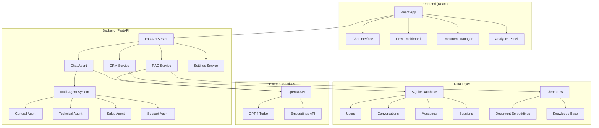
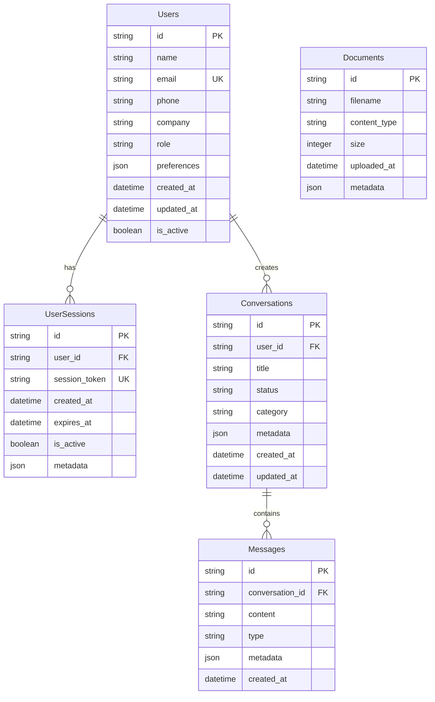

# Multi-Agentic Conversational AI System

A comprehensive chatbot system with RAG (Retrieval-Augmented Generation) capabilities and integrated CRM functionality. Built with FastAPI backend and React frontend.

## 🚀 Features

### Core Features
- **RESTful API** built with FastAPI
- **Multi-Agent Chat System** with specialized agents for different domains
- **RAG Integration** for document-based question answering
- **CRM Module** with user management and conversation history
- **Document Ingestion** supporting multiple file formats (CSV, JSON, PDF, TXT)
- **Real-time Processing** with metadata tracking
- **Session Management** with user authentication
- **Analytics Dashboard** with system insights

### Advanced Features
- **Intelligent Document Processing** with automatic text extraction
- **Conversation Analytics** with response time tracking
- **User Behavior Analysis** and conversation categorization
- **System Health Monitoring** with performance metrics
- **Scalable Architecture** with modular design
- **Comprehensive Error Handling** and logging

## 🏗️ Architecture

### System Architecture Diagram



### CRM Schema Diagram



## 📋 Requirements

- Python 3.8+
- Node.js 16+
- OpenAI API Key

## 🛠️ Installation & Setup

### 1. Clone the Repository

```bash
git clone https://github.com/yourusername/multi-agentic-conversation-ai-system.git
cd multi-agentic-conversation-ai-system
```

### 2. Backend Setup

```bash
# Create virtual environment
python -m venv venv

# Activate virtual environment
# On Windows:
venv\Scripts\activate
# On macOS/Linux:
source venv/bin/activate

# Install Python dependencies
pip install -r requirements.txt
```

### 3. Frontend Setup

```bash
cd frontend
npm install
cd ..
```

### 4. Environment Configuration

Create a `.env` file in the root directory:

```env
# OpenAI Configuration
OPENAI_API_KEY=your_openai_api_key_here
OPENAI_MODEL=gpt-4-turbo-preview

# Database Configuration
DATABASE_URL=sqlite:///./crm_chatbot.db

# Vector Database Configuration
CHROMA_DB_PATH=./chroma_db

# API Configuration
API_HOST=0.0.0.0
API_PORT=8000
DEBUG=false

# Security
SECRET_KEY=your_secret_key_here_change_in_production
ALGORITHM=HS256
ACCESS_TOKEN_EXPIRE_MINUTES=30

# RAG Configuration
CHUNK_SIZE=1000
CHUNK_OVERLAP=200
MAX_RETRIEVAL_DOCS=5

# Chat Configuration
MAX_CONVERSATION_HISTORY=50
DEFAULT_TEMPERATURE=0.7
MAX_TOKENS=1000
```

### 5. Initialize Database and Load Data

```bash
# Activate virtual environment (if not already activated)
source venv/bin/activate  # On Windows: venv\Scripts\activate

# Initialize database and load sample data
python data_management.py --load
```

## 🚀 Running the Application

### Development Mode

```bash
# Terminal 1 - Start backend server
source venv/bin/activate  # On Windows: venv\Scripts\activate
uvicorn main:app --reload --host 0.0.0.0 --port 8000

# Terminal 2 - Start frontend (in a new terminal)
cd frontend
npm start
```

### Production Mode

```bash
# Build frontend first
cd frontend
npm run build
cd ..

# Start production server
source venv/bin/activate  # On Windows: venv\Scripts\activate
uvicorn main:app --host 0.0.0.0 --port 8000
```

The application will be available at:
- **Backend API**: http://localhost:8000
- **Frontend**: http://localhost:3000 (development) or http://localhost:8000 (production)
- **API Documentation**: http://localhost:8000/docs

### Quick Start Summary

```bash
# 1. Clone and setup
git clone https://github.com/yourusername/multi-agentic-conversation-ai-system.git
cd multi-agentic-conversation-ai-system

# 2. Backend setup
python -m venv venv
source venv/bin/activate  # Windows: venv\Scripts\activate
pip install -r requirements.txt

# 3. Frontend setup
cd frontend && npm install && cd ..

# 4. Create .env file and add your OpenAI API key
echo "OPENAI_API_KEY=your_api_key_here" > .env

# 5. Initialize database
python data_management.py --load

# 6. Run the application
uvicorn main:app --reload --host 0.0.0.0 --port 8000
# In another terminal: cd frontend && npm start
```

## 📊 API Documentation

For comprehensive API documentation including all endpoints, request/response schemas, and examples, see **[API_DOCUMENTATION.md](API_DOCUMENTATION.md)**.

### Quick Reference - Core Endpoints

#### Chat Endpoint
```http
POST /chat
Content-Type: application/json

{
  "message": "Hello, how can you help me?",
  "user_id": "user123",
  "conversation_id": "conv456"
}
```

**Response:**
```json
{
  "response": "Hello! I'm here to help you with any questions...",
  "conversation_id": "conv456",
  "user_info": {
    "id": "user123",
    "name": "John Doe",
    "email": "john@example.com"
  },
  "rag_context": [...],
  "metadata": {
    "response_time": 1.23,
    "tokens_used": 150,
    "agent_used": "general_agent",
    "rag_documents_retrieved": 3
  }
}
```

#### CRM Endpoints

**Create User:**
```http
POST /crm/create_user
Content-Type: application/json

{
  "name": "John Doe",
  "email": "john@example.com",
  "phone": "+1234567890",
  "company": "Acme Corp",
  "role": "Manager"
}
```

**Get User Conversations:**
```http
GET /crm/conversations/{user_id}?page=1&per_page=10
```

#### Document Management

**Upload Documents:**
```http
POST /upload_docs
Content-Type: multipart/form-data

files: [file1.pdf, file2.csv, file3.txt]
```

**Get RAG Statistics:**
```http
GET /rag/stats
```

### Processing Metadata

All endpoints return processing metadata including:
- `response_time`: Processing time in seconds
- `tokens_used`: Number of tokens consumed
- `agent_used`: Which agent processed the request
- `rag_documents_retrieved`: Number of documents retrieved for context
- `timestamp`: Request timestamp
- `request_id`: Unique request identifier

### Error Handling

All endpoints return structured error responses:
```json
{
  "success": false,
  "error": "Error description",
  "details": "Additional error details",
  "timestamp": "2024-01-01T00:00:00Z"
}
```

## 🗂️ Data Management

### Supported File Formats

- **CSV**: Structured data processing
- **JSON**: Hierarchical data handling
- **PDF**: Text extraction and processing
- **TXT**: Plain text documents

### Document Ingestion Process

1. **Upload**: Files uploaded via `/upload_docs` endpoint
2. **Processing**: Content extracted and cleaned
3. **Chunking**: Documents split into manageable chunks
4. **Embedding**: Text converted to vector embeddings
5. **Storage**: Stored in ChromaDB for retrieval

### Data Management CLI

```bash
# Show collection statistics
python data_management.py --stats

# List all data files
python data_management.py --list

# Load data files
python data_management.py --load

# Force reload all data
python data_management.py --reload

# Clear collection
python data_management.py --clear
```

## 🔧 Configuration

### Environment Variables

| Variable | Description | Default |
|----------|-------------|---------|
| `OPENAI_API_KEY` | OpenAI API key | Required |
| `OPENAI_MODEL` | OpenAI model to use | `gpt-4-turbo-preview` |
| `DATABASE_URL` | Database connection URL | `sqlite:///./crm_chatbot.db` |
| `CHROMA_DB_PATH` | Vector database path | `./chroma_db` |
| `API_HOST` | API server host | `0.0.0.0` |
| `API_PORT` | API server port | `8000` |
| `CHUNK_SIZE` | Document chunk size | `1000` |
| `MAX_RETRIEVAL_DOCS` | Max documents for RAG | `5` |

### Agent Configuration

The system includes four specialized agents:

1. **General Agent**: Handles general inquiries and conversations
2. **Technical Agent**: Focuses on technical support and documentation
3. **Sales Agent**: Specializes in sales-related queries and product information
4. **Support Agent**: Manages customer support and troubleshooting

## 📈 Analytics & Monitoring

### System Health

Monitor system health at `/admin/health/detailed`:
- API response times
- Database performance
- Memory usage
- Error rates
- Active sessions

### User Analytics

Track user behavior and conversation patterns:
- Message frequency
- Response times
- Popular topics
- User engagement metrics

### Conversation Analytics

Analyze conversation quality and effectiveness:
- Average response time
- Token usage
- Success rates
- Error patterns

## 🔒 Security

### Session Management

- Token-based authentication using secure random tokens
- Configurable session expiration
- Session validation and cleanup
- User session tracking

### Data Protection

- Input validation and sanitization
- SQL injection prevention
- XSS protection
- Rate limiting (can be implemented)


## 📦 Deployment

### Local Deployment

```bash
# Build frontend
cd frontend && npm run build

# Start server
python main.py
```

### Production Deployment

1. **Environment Setup**: Configure production environment variables
2. **Database**: Set up production database
3. **Static Files**: Ensure frontend build is properly served
4. **Process Management**: Use gunicorn or similar for production WSGI
5. **Reverse Proxy**: Configure nginx or similar for load balancing

## 📝 Development

### Project Structure

```
multi-agentic-conversation-ai-system/
├── README.md                    # Main documentation
├── API_DOCUMENTATION.md         # Complete API reference
├── main.py                     # FastAPI application
├── requirements.txt            # Python dependencies
├── config.py                   # Configuration settings
├── database.py                 # Database setup
├── data_management.py          # Data management utilities
├── frontend/                   # React frontend
│   ├── src/
│   │   ├── components/        # React components
│   │   ├── services/          # API services
│   │   └── ...
│   ├── package.json
│   └── package-lock.json
├── services/                   # Backend services
│   ├── chat_agent.py          # Multi-agent chat system
│   ├── crm_service.py         # CRM functionality
│   ├── rag_service.py         # RAG implementation
│   └── settings_service.py    # System settings
├── models/                     # Database models
├── schemas/                    # API schemas
├── data/                      # Data files for ingestion
└── chroma_db/                 # Vector database storage
```

### Adding New Features

1. **New Agent**: Extend the agent system in `services/chat_agent.py`
2. **New Endpoint**: Add to `main.py` with proper error handling
3. **New CRM Feature**: Extend `services/crm_service.py`
4. **New Document Type**: Update `services/rag_service.py`

### Code Quality

- Follow PEP 8 for Python code
- Use ESLint for JavaScript/React code
- Include comprehensive error handling
- Add proper logging and monitoring

## 🤝 Contributing

1. Fork the repository
2. Create a feature branch
3. Make your changes
4. Submit a pull request

## 📄 License

This project is licensed under the MIT License - see the LICENSE file for details.

## 🆘 Support

For issues and questions:
1. Check the API documentation at `/docs`
2. Review the error logs
3. Consult the troubleshooting section
4. Create an issue in the GitHub repository

## 🎯 Future Enhancements

- **Multi-language Support**: Internationalization
- **Voice Integration**: Speech-to-text and text-to-speech
- **Advanced Analytics**: Machine learning insights
- **Plugin System**: Extensible architecture
- **Mobile App**: React Native implementation
- **Enterprise Features**: SSO, advanced security
- **Real-time Collaboration**: WebSocket integration

## ✅ Submission Checklist

This project meets all the required submission criteria:

### Core Requirements
- ✅ **RESTful API app in Python** - Built with FastAPI
- ✅ **Working chatbot endpoint** - `/chat` endpoint with full RAG integration
- ✅ **Fully functional CRM module** - User management, conversation tracking, analytics
- ✅ **Document ingestion and indexing** - Supports CSV, JSON, PDF, TXT files
- ✅ **Processing metadata** - Response time, token usage, agent info in all endpoints
- ✅ **Structured JSON responses** - Consistent API response format

### Documentation & Setup
- ✅ **README.md** - Comprehensive setup and usage instructions
- ✅ **Environment configuration** - Clear .env setup with all required variables
- ✅ **CRM schema diagram** - Mermaid diagrams for database and system architecture
- ✅ **API contracts** - Complete API documentation with schemas and examples
- ✅ **Simple setup process** - Straightforward installation steps

### Technical Features
- ✅ **Multi-agent system** - 4 specialized agents for different domains
- ✅ **Session management** - Token-based authentication and session handling
- ✅ **Analytics dashboard** - System and user analytics with detailed metrics
- ✅ **Error handling** - Comprehensive error responses with proper HTTP status codes
- ✅ **Health monitoring** - System health checks and performance metrics

### Files Structure
```
📁 Project Root
├── 📄 README.md                 # Main documentation
├── 📄 API_DOCUMENTATION.md      # Complete API reference
├── 📄 main.py                  # FastAPI application
├── 📄 requirements.txt         # Python dependencies
├── 📁 frontend/                # React application
├── 📁 services/                # Backend services
├── 📁 models/                  # Database models
├── 📁 schemas/                 # API schemas
└── 📁 data/                   # Sample data for RAG
```

---

**Built with ❤️ using FastAPI, React, and OpenAI** 